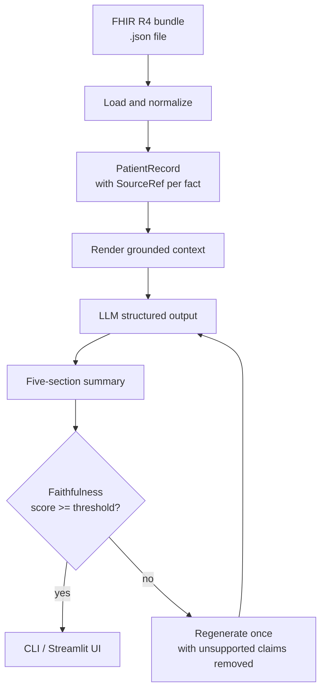

# FHIR Clinical Summarizer

FHIR Clinical Summarizer turns a synthetic FHIR R4 patient bundle into a short,
clinician-readable patient summary with a faithfulness check for every bullet.

It is built as a portfolio demo for clinical AI safety patterns: grounded
summarization, source provenance, missing-data discipline, and a visible
verification report. It is not a medical device and should not be used with real
patient data.

## What You Can Do

- Open a Streamlit demo and summarize one of the included synthetic patients.
- Upload a FHIR R4 bundle and see a five-section clinical summary.
- Run fully offline in rules-only mode with no API key.
- Run the live LLM pipeline when you provide a LiteLLM-compatible model and API
  key.
- Inspect a per-bullet faithfulness report that shows whether summary claims are
  supported by the source bundle.

The summary always uses the same sections:

1. Problems
2. Medications
3. Recent Encounters
4. Key Results
5. Allergies

## Quick Start

Requirements:

- Python 3.11+
- `uv`

Install and run the app:

```bash
uv sync --extra dev
uv run streamlit run src/summarizer/app.py
```

In the app:

1. Choose one of the included fixture patients.
2. Leave `Rules-only (no API key)` checked for the fastest local demo.
3. Click `Summarize`.

The app shows patient counts, the generated summary, and the faithfulness table.

## Live LLM Mode

Rules-only mode is enough to try the workflow. To run the real LLM summarizer,
create a `.env` file and add your provider credentials:

```bash
cp .env.example .env
```

Then edit `.env`:

```bash
LLM_MODEL=anthropic/claude-opus-4-8
ANTHROPIC_API_KEY=sk-ant-...
```

Other LiteLLM provider/model strings work as long as the matching API key is set
in the environment. In the Streamlit app, uncheck `Rules-only (no API key)` to
call the configured model.

## Command Line Usage

Inspect a bundle without calling an LLM:

```bash
uv run python -m summarizer.cli fixtures/alpha.json --render
```

Run the full summary pipeline:

```bash
uv run python -m summarizer.cli fixtures/alpha.json --summarize
```

Run the faithfulness evaluation:

```bash
uv run python -m clinical_core.eval.faithfulness --fixtures
uv run python -m clinical_core.eval.faithfulness --n 10
uv run python -m clinical_core.eval.faithfulness --n 10 --live
```

The eval command writes `eval_report.md`. The default rules-only runs are
deterministic and do not need an API key.

## Safety And Privacy

- Use synthetic data only. The included patients come from Synthea samples; no
  real PHI is included.
- The Streamlit app runs locally. The only outbound call is to the LLM provider
  you configure, and only when rules-only mode is turned off.
- The summarizer is designed not to invent negative findings. For example,
  "No known allergies" is only emitted when the source bundle explicitly supports
  it.
- Every summary bullet is expected to carry source references back to the FHIR
  resources that support it.
- If the faithfulness score falls below the configured threshold, the pipeline
  regenerates once. If it still fails, the failure is surfaced instead of hidden.

## How It Works



The key design choice is provenance. Each normalized clinical fact keeps a
`SourceRef` pointing back to its FHIR resource. The summarizer is instructed to
attach those refs to each bullet, and the faithfulness checker evaluates each
claim against its referenced sources.

## Included Data

This repository includes three committed synthetic fixtures:

- `fixtures/alpha.json`: richer patient history
- `fixtures/beta.json`: sparse record with missing dates
- `fixtures/gamma.json`: explicit no-known-allergies case

Additional generated Synthea bundles can live in `data/synthea/`. That directory
is intended for local generated data and is not required for the demo.

## Development

Run the test suite:

```bash
uv run pytest
```

If you intentionally change FHIR extraction behavior, update and review the
snapshot tests:

```bash
uv run pytest --snapshot-update
```

Project layout:

```text
src/clinical_core/   shared FHIR loading, LLM wrapper, settings, and eval code
src/summarizer/      rendering, prompts, pipeline, CLI, and Streamlit app
fixtures/            committed synthetic patients used by tests and demo
tests/               pytest coverage and snapshot tests
eval_report.md       generated evaluation report, gitignored
```

For implementation contracts and project history, see `CONTRACTS.md` and
`execute-plan.md`.
